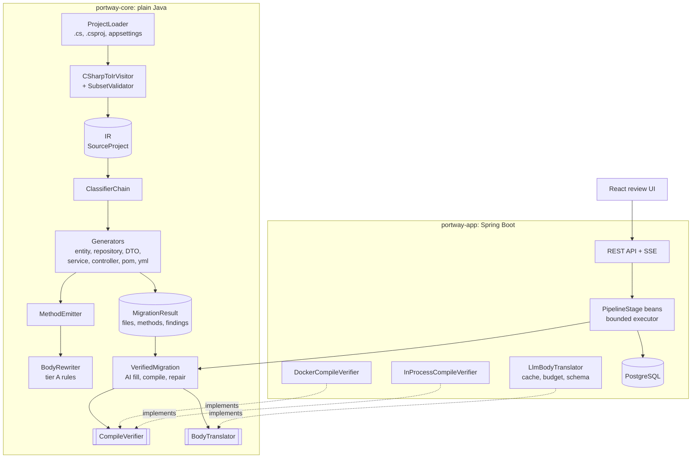

# Architecture and decision log

## Shape

The core library knows nothing about Spring, HTTP, databases or any particular LLM. It defines two
interfaces, `CompileVerifier` and `BodyTranslator`, and the application supplies implementations.
That boundary is why the CLI works without a database and why the rule engine's 246 tests run in
seconds.

## Decisions

### An intermediate model instead of text-to-text translation

C# is parsed into records that describe structure (types, members, signatures, attributes) and
nothing else. Generation reads only the IR. The parse tree is not the IR: ANTLR contexts are tied to
the grammar, and every grammar patch would otherwise ripple through every generator.

Method bodies stay as source text. Modelling C# statements and expressions would mean writing a
compiler, and the project would not finish. The line between structure (modelled) and bodies (text,
rewritten by rules) is the most important boundary in the codebase.

### Rules before the model, and the model only for gaps

A rule is deterministic, testable and explainable. The rule engine translates 14 of the sample's 16
method bodies. The model is asked only about bodies the rules reject, and never about constructs
with no honest Java equivalent (`yield return`, `ref`/`out`). If the model were handling most
methods, the right fix would be better rules, not more model.

A body qualifies for the rules only if, after rewriting, no C#-specific token remains and the
result parses as Java. The residual scan is what keeps a partially rewritten body from passing as a
translation.

### Nothing is trusted until it compiles

Generated code is compiled before anyone sees it. The compiler's errors are mapped back to the
method that caused them, so one bad method is dealt with without discarding its file. A body the
model wrote gets exactly one repair attempt with the compiler's message; a second failure, or any
rule-written body that fails, becomes a stub. A translator that fails twice is not converging.

The stub is deliberate: it compiles, throws `UnsupportedOperationException`, and carries the
original C# in its Javadoc. The project still builds and the reviewer has an exact, actionable item.

### Minimum confidence, not average

A file's confidence is its weakest method's. One stubbed method in a file of rule-translated
methods makes the file low confidence. An average would let that method hide, and the reviewer
needs to know the worst thing in the file, not the mean.

### Reject loudly rather than translate wrongly

The vendored grammar accepts far more C# than the IR can represent. Before `SubsetValidator`, a
pointer field parsed cleanly and became an `int`, and a nested class vanished. Files with
unsupported constructs are now rejected with the construct and line named, and the rest of the
project still migrates. Plausible-looking Java generated from a half-understood file is worse than a
clear error, because nobody knows to review it.

### Two verifiers behind one interface

A real Maven build in a container is the honest check: it resolves the generated pom and runs the
real compiler. It runs with no network, capped memory and CPU, a timeout, and on a copy of the
project, because generated code is untrusted input. An offline build needs a warm repository, so a
separate networked container resolves each distinct pom's dependencies first. That container
downloads artifacts and never compiles generated code.

Azure Container Apps has no Docker socket, so the cloud deployment compiles in-process with javac
against a fixed classpath of the APIs generated code may import. It is fast and weaker: it cannot
catch a dependency missing from the pom. The verifier's name says so, and the UI shows a banner.
The in-process classpath ships inside the jar as resources, not on the application's own classpath,
where Spring Security would switch on security auto-configuration for Portway itself.

### The model's output is data, not code

Every response has to parse as JSON, validate against a JSON Schema, and pass checks that the body
is a body: no fences, no signature, no class. Structured outputs already constrain the reply to the
schema, and it is validated again locally regardless. Nothing is regex-scraped out of prose.

The system prompt includes the type-mapping table rendered from the same YAML the rule engine
reads, so the model and the rules cannot disagree about what `decimal` becomes.

Cost is bounded: responses are cached by a hash of model and prompt, at most three calls run at
once, 429s and 5xx are retried with backoff, and each job has a token budget that is a hard stop.

### Data-driven mapping tables

Type mappings and NuGet-to-Maven mappings are YAML, not switch statements. They can be reviewed and
extended without a recompile, and every lossy mapping is visible in one place with the finding it
raises.

### Constructor injection only, no Lombok

Generated code is read by a human before it is trusted. Constructor injection makes dependencies
explicit and lets fields be final. Lombok would make the reviewer expand annotations in their head
to check the migration.

### Golden files as the backbone, and every golden file compiles

A transpiler is tested with input and expected output. Each case in `testdata/` pins what the rules
produce, and a second test compiles every expectation. On its first run that second test caught two
bugs the golden diff would have blessed: a `BadRequest(string)` inside a
`ResponseEntity<List<T>>`, and an implicit `Ok()` wrapped around a ternary that already returned
results.

## Scaling

Migrations run one per thread on a bounded executor (2 to 4 threads, queue of 10); a full queue is
a 503. Parsing and generation are fast and CPU-bound. Compilation is slow and the risky part. To
scale, compile verification would move onto a queue with separate workers, keeping parse and
generate in the API.
