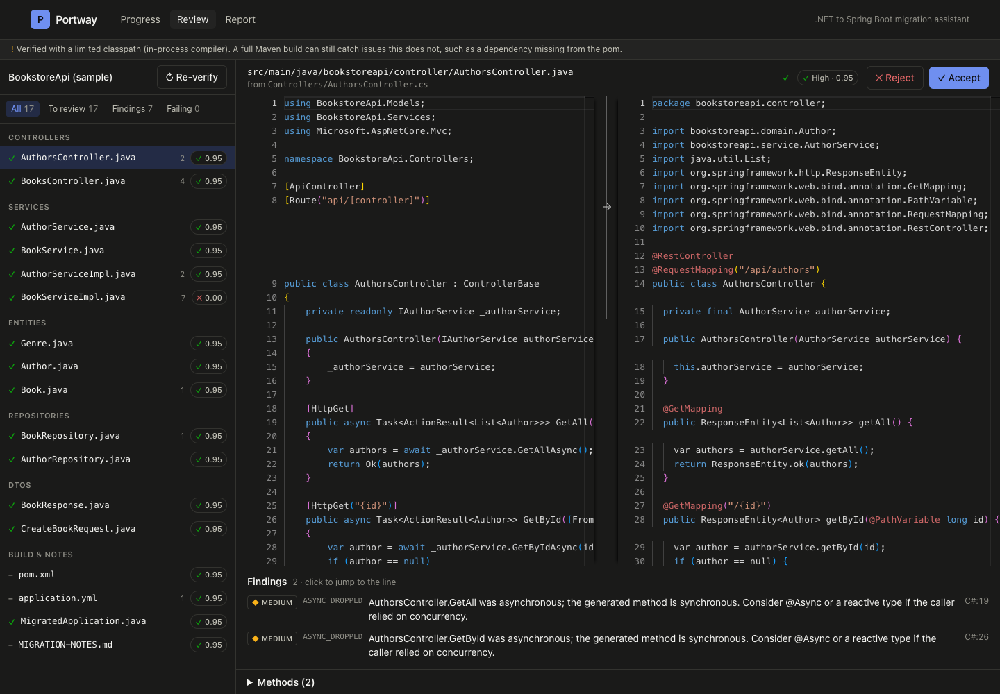
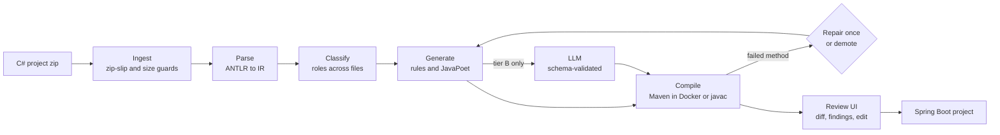

# Portway

**A .NET to Spring Boot migration assistant.** It parses an ASP.NET Core service into a
language-neutral model, applies deterministic mapping rules to produce a Spring Boot equivalent,
uses an LLM only for the method bodies the rules cannot handle, and compiles every generated file
before a human reviews it.



## The problem

Enterprise .NET-to-Java migration is mostly manual. Asking an LLM to translate whole files is fast,
but the output cannot be trusted: nothing tells you which lines are wrong, and the ones that are
wrong look exactly like the ones that are right.

## The approach

1. **Parse to an intermediate model, never text to text.** C# is parsed with ANTLR into a
   structural IR: types, members, signatures, attributes. Method bodies stay as source text.
2. **Rules first.** Types, attributes, routing, dependency injection, EF DbSets, LINQ chains,
   `ActionResult`s and dozens of other idioms are translated by deterministic, tested rules.
3. **The LLM only for the gaps**, and only when asked for. It fills the method bodies the rules
   gave up on, and never writes a signature.
4. **Everything is compiled.** A body that does not compile gets one repair attempt with the
   compiler's message if the model wrote it; otherwise, or if the repair fails, it becomes a stub
   that compiles, throws, and carries the original C# in its Javadoc.
5. **A human reviews** each file beside its source, with a confidence score and findings. A file's
   confidence is its weakest method's, never the average.

## Results on the sample project

The sample in [`sample-dotnet/BookstoreApi`](sample-dotnet/BookstoreApi) is a small ASP.NET Core 8
API (controllers, EF Core entities, services, DTOs) written as a test fixture. It includes a
decimal price, async methods, a nullable reference, a chained LINQ query and a `yield return` on
purpose, because those are where migration gets hard.

Without AI:

| | |
|---|---|
| Generated files | 17: entities, repositories, DTOs, services, controllers, `pom.xml`, `application.yml`, notes |
| Method bodies | **14 of 16 translated by rules**, 2 flagged for review |
| Flagged | `TotalCatalogueValue` does `decimal` arithmetic (BigDecimal has no operators): eligible for AI. `StreamInStock` uses `yield return`: never sent to the model, stubbed for a human |
| Compile check | Clean, verified automatically; the output also builds with a real `mvn package` |

With AI enabled, the decimal method is the only one the model is asked to translate. The
`yield return` method is never sent to it.

The generated application also runs: against PostgreSQL it serves every migrated endpoint,
including validation errors, 404s and the `Location` header on create.

### On code it was not written against

The sample was written alongside the tool, so it proves less than it seems. Portway was also run on
Microsoft's own [TodoApi tutorial](https://github.com/dotnet/AspNetCore.Docs/tree/main/aspnetcore/tutorials/first-web-api/samples/8.0),
both variants, unchanged:

| | TodoApi | TodoApiDTO |
|---|---|---|
| Method bodies by rules | 5 of 7 | 6 of 8 |
| Flagged | a `throw;` rethrow; `Enumerable.Range(...).ToArray()` | a `catch ... when` exception filter; the same `ToArray()` |
| Generated app | compiles, starts, full CRUD works, JSON matches the .NET shape | same |

That run found two bugs that compiling could not: EF's convention key (a bare `Id` property) got no
`@Id`, so the app failed at startup, and returning an entity with a lazy association failed during
JSON serialisation. Both are fixed, and a test now boots Hibernate over every generated entity so
that class of error fails the build.

## What it handles

- **Structure:** namespaces (file-scoped and block), classes, interfaces, enums, properties with
  initializers, constructor injection, generics, arrays, nullable value and reference types.
- **Entities:** `DbSet<T>` discovery, `[Key]`, `[Table]`, `[Column]`, `[ForeignKey]`,
  `[DatabaseGenerated]`, `[NotMapped]`, many-to-one and one-to-many associations with the join
  column on the owning side, enums persisted as strings.
- **Repositories:** one Spring Data `JpaRepository` per `DbSet`, with the key type boxed.
- **Services:** `IFoo`/`Foo` become `Foo`/`FooImpl` (configurable), `@Transactional` where EF was
  used, an EF DbContext replaced by just the repositories the class touches, `ILogger<T>` to SLF4J,
  `IOptions<T>` to the options type.
- **Controllers:** `[Route("api/[controller]")]`, `[HttpGet("{id:int}")]` and friends, parameter
  binding from attributes or ASP.NET convention, `[FromBody]` with `@Valid`, `[Authorize(Roles)]` to
  `@PreAuthorize`, `Ok`/`NotFound`/`BadRequest`/`NoContent`/`CreatedAtAction` to `ResponseEntity`,
  including the Location header built from the target action's route.
- **Method bodies (rules):** `await`, EF queries to repository calls (a key lookup becomes
  `findById`), LINQ method chains to one stream pipeline, properties to getters and setters, object
  initializers, null-conditional and null-coalescing operators, string interpolation, `foreach`,
  common exceptions, `string.IsNullOrEmpty`, `Task.FromResult`, logging message templates.
- **Validation and JSON:** `[Required]`, `[StringLength]`, `[MinLength]`, `[MaxLength]`, `[Range]`,
  `[EmailAddress]`, `[RegularExpression]`, `[JsonPropertyName]`, `[JsonIgnore]`.
- **Project files:** `.csproj` packages to Maven dependencies from a
  [data-driven table](portway-core/src/main/resources/dependency-mappings.yaml); `appsettings.json`
  to `application.yml`, with connection strings converted to JDBC URLs.

## What it does not handle

Every one of these is reported, with what happened instead. None of them is silently dropped.

| Construct | What happens |
|---|---|
| `yield return`, `ref`/`out`/`in` parameters, `goto` | Method stubbed for a human; never sent to the model |
| `decimal` arithmetic, switch expressions, pattern matching, `nameof`, `typeof`, `using` statements, LINQ `GroupBy`/`ThenBy`/`SelectMany`, direct `Task` APIs | Rules stop; eligible for AI; otherwise stubbed |
| LINQ query syntax (`from x in y select`), `unsafe`, pointers, `stackalloc` | File rejected with the construct and line named |
| Nested types, indexers, operator overloads, events, finalizers | File rejected with the construct and line named |
| `record` types and other syntax newer than C# 9 beyond target-typed `new()` and switch expressions | File rejected as a syntax error |
| EF fluent configuration in `OnModelCreating` | Not translated; copied verbatim into `MIGRATION-NOTES.md` with a HIGH finding |
| `Program.cs` middleware | Not translated line by line; DI registrations and `Configure<T>` bindings are read from it |
| `async` semantics | Dropped: the Java is synchronous, and every affected method gets an `ASYNC_DROPPED` finding |
| Unknown NuGet packages | Nothing added to the pom; an `UNKNOWN_PACKAGE` finding names each one |
| `#if` blocks | Evaluated with no symbols defined, as a Release build would be |

A LINQ chain is translated only when it is a straight sequence of known operators; one `.stream()`
goes at the head and one terminal at the end. Anything else goes to the model or a human.
[`PARSER-NOTES.md`](PARSER-NOTES.md) has the measured parser subset.

## Architecture



- **`portway-core`**: plain Java, no Spring. Parser, IR, classifier, rules, generators, the
  verify-and-repair loop. Fast to test and usable from the command line.
- **`portway-app`**: Spring Boot. REST API, pipeline stages on a bounded executor, SSE progress,
  PostgreSQL persistence, the Docker verifier and the LLM client.
- **`web`**: React and TypeScript review interface with Monaco side-by-side views.

Design decisions and the reasoning behind them are in [`ARCHITECTURE.md`](ARCHITECTURE.md).

## Running it

With Docker:

```bash
docker compose -f docker/docker-compose.yml up --build
open http://localhost:8080          # "Use sample project" runs a migration in one click
```

From the command line, no database needed (Java 21):

```bash
mvn -B package -DskipTests
java -jar portway-app/target/portway-app-0.1.0-SNAPSHOT.jar migrate sample-dotnet/BookstoreApi -o ./out
```

For AI translation, set `ANTHROPIC_API_KEY` and add `--ai` (CLI) or `PORTWAY_AI_ENABLED=true`
(server). The model is configurable with `PORTWAY_AI_MODEL`. Real Maven verification in Docker
is `--verifier docker` (CLI) or `PORTWAY_VERIFY_MODE=docker` (server).

For development, start only the database (`docker compose -f docker/docker-compose.yml up db`),
then `mvn install -DskipTests && mvn -pl portway-app spring-boot:run`, and `npm run dev --prefix
web` for the UI with hot reload on port 5173.

The build compiles with JDK 21 selected through a Maven toolchain, whatever `JAVA_HOME` points at.
Declare one in `~/.m2/toolchains.xml` (GitHub's `setup-java` and the Docker build do this for you).

API documentation is served at `/swagger-ui.html`.

## Testing

| Suite | What it covers |
|---|---|
| Golden files, [`testdata/`](testdata) | Ten input/expected-output cases: entities, controllers, repositories, LINQ, async, validation, nullable types, unsupported constructs, csproj to pom, EF conventions. Every expectation is also compiled. Regenerate with `-Dupdate.golden=true`, then read the diff |
| Generated entities boot | Hibernate is started over the generated entities of every case and the sample, against H2, and creates the schema. Catches mappings that compile but fail at startup |
| Rule tests | Each body rewrite rule, type mapping and attribute mapping, table-driven |
| Verify loop | Rule failures demoted, AI failures repaired once then demoted, errors outside methods reported, all against the real compiler |
| LLM layer | WireMock stubs: request shape, cache, malformed JSON, schema violations, refusal, 429 recovery, 5xx, token budget. The real API is never called in tests |
| Integration | The whole application against PostgreSQL in Testcontainers: upload, pipeline, SSE, review, re-verify, download, AI job with caching |
| Frontend | Vitest and Testing Library: filters, review actions, the strategy chart |

`mvn verify` runs 292 Java tests and fails below 70% line coverage on `portway-core`
(ANTLR-generated code excluded). `npm test --prefix web` runs 12 more.

## Deploying

The image is published to GHCR by [`docker.yml`](.github/workflows/docker.yml). Pushing a `v*` tag
also deploys it to Azure Container Apps through [`deploy.yml`](.github/workflows/deploy.yml). The
cloud profile verifies in-process, because Container Apps has no Docker socket; the UI says so.

One-time setup, with the Azure CLI:

```bash
az containerapp create -g <group> -n portway --environment <env> \
  --image ghcr.io/<owner>/portway:<version> --target-port 8080 --ingress external \
  --secrets db-url=<jdbc-url> db-user=<user> db-password=<password> \
  --env-vars SPRING_PROFILES_ACTIVE=cloud PORTWAY_DB_URL=secretref:db-url \
             PORTWAY_DB_USER=secretref:db-user PORTWAY_DB_PASSWORD=secretref:db-password
```

Then add a federated credential for the repository and set the `AZURE_CLIENT_ID`,
`AZURE_TENANT_ID` and `AZURE_SUBSCRIPTION_ID` secrets and the `AZURE_RESOURCE_GROUP` and
`AZURE_CONTAINERAPP_NAME` variables. Any PostgreSQL 16 works, including a free Neon or Supabase
instance.

## Tech stack

Java 21, Spring Boot 3.5, Spring Data JPA, Flyway, PostgreSQL 16, ANTLR 4, JavaPoet,
google-java-format, Testcontainers, the Anthropic Java SDK, networknt JSON Schema, JUnit 5,
WireMock, React 18, TypeScript, Vite, Tailwind CSS, TanStack Query, Monaco Editor, Vitest,
GitHub Actions, Docker, Azure Container Apps.
